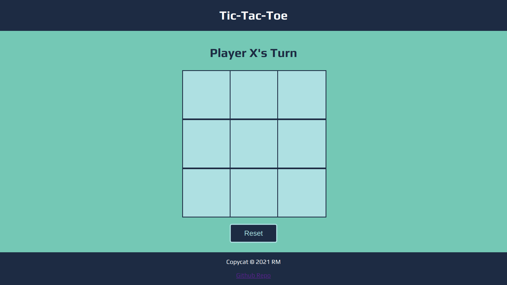
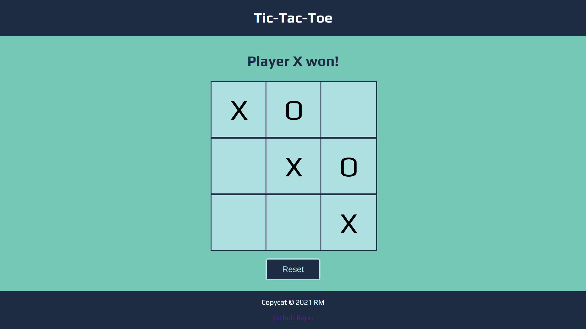
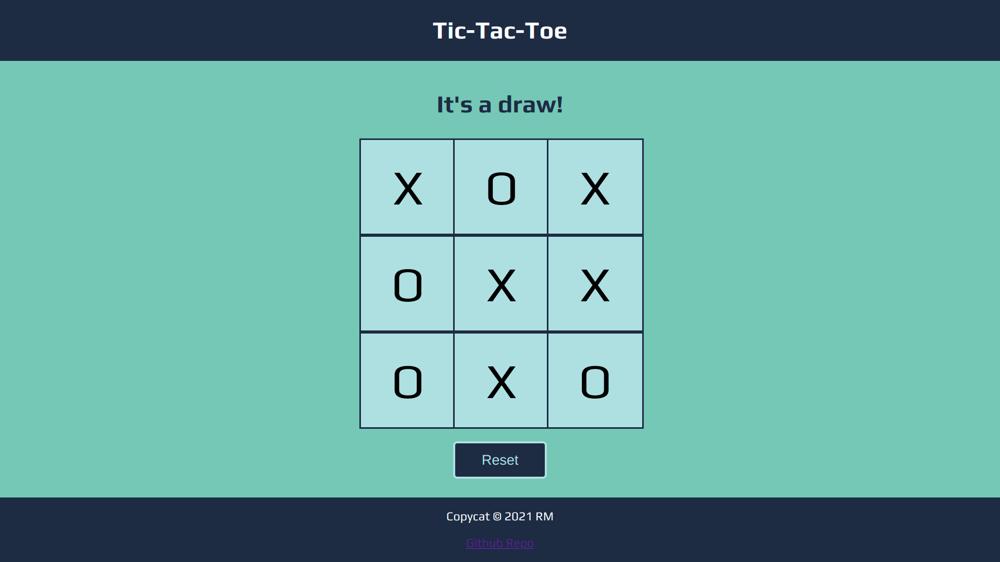

# Tic Tac Toe

[Link to live demo.](https://rosendo-martinez.github.io/tic-tac-toe/) 👈

This project uses [**modules**](https://www.freecodecamp.org/news/javascript-modules-a-beginner-s-guide-783f7d7a5fcc/), [**factory functions**](https://www.javascripttutorial.net/javascript-factory-functions/), and [**IIFEs**](https://www.javascripttutorial.net/javascript-immediately-invoked-function-expression-iife/)!

# Screenshots 

This project is an assignment from TOP's [fullstack Javascript developer program](https://www.theodinproject.com/paths/full-stack-javascript). 
